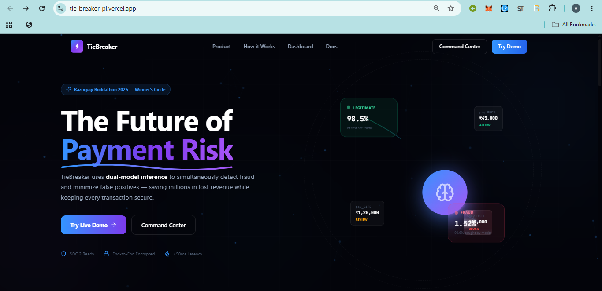
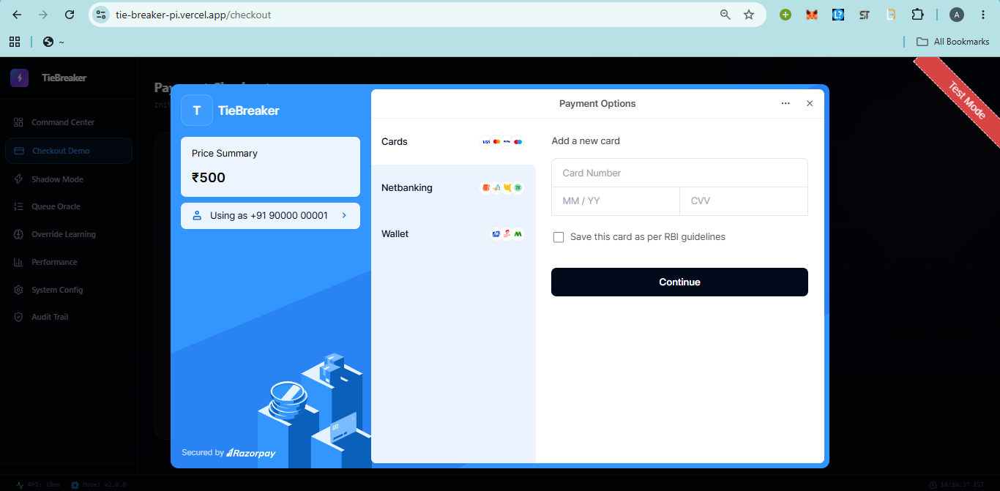
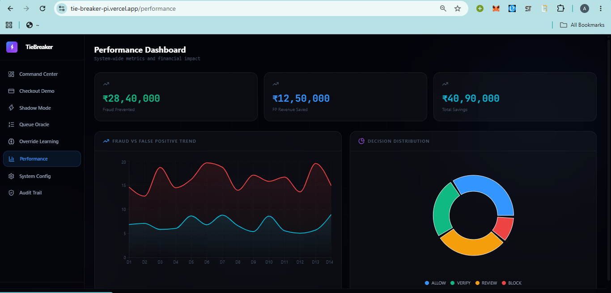
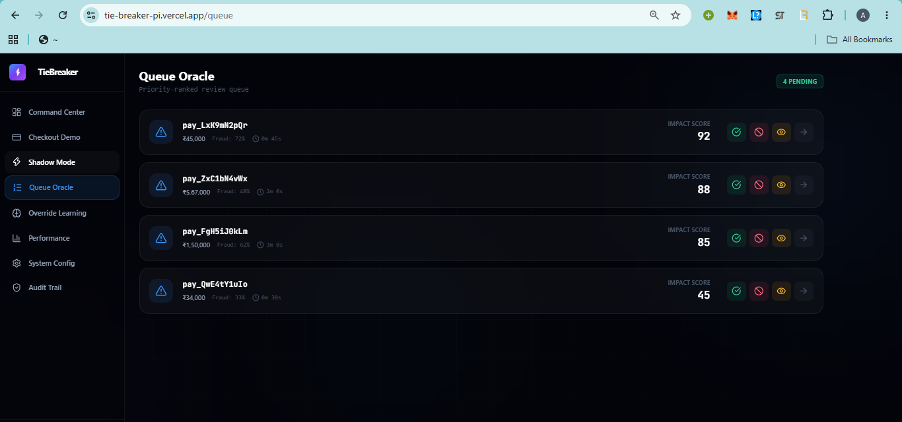

# TieBreaker

**Cost-aware payment risk decisioning — built for Razorpay Buildathon 2026, Track 2 (AI Risk Manager)**

  

**Live demo:** https://tie-breaker-pi.vercel.app

<!-- SCREENSHOT: put a hero shot / GIF of the landing page or checkout flow here -->
<!--  -->

---

## The problem

Most fraud systems optimize for one thing: catching fraud. But blocking a legitimate customer isn't free — it costs the merchant a customer, and often more revenue than the fraud it prevented would have cost. Treating fraud detection as a single classification problem ignores that trade-off entirely.

## What TieBreaker does

TieBreaker scores every transaction with **two independent models** — not one:

1. **Fraud model** — probability this transaction is fraudulent
2. **False-positive model** — probability this transaction is legitimate but *looks* risky

A **Strike Decision Engine** then computes the expected rupee loss of every possible action — **ALLOW / VERIFY / REVIEW / BLOCK** — and picks whichever minimizes expected loss. It doesn't threshold on fraud probability alone; it reasons about cost.

## Screenshots

### Landing Page


### Razorpay Test Mode Checkout



## Model performance (real data, not synthetic)

Trained and evaluated on the **IEEE-CIS Fraud Detection dataset** (Kaggle) — a genuine, class-imbalanced, real-world fraud dataset — not synthetic rule-generated data.

**Setup:** 120,000-row temporal head of the dataset · 84,000 train / 18,000 test · strict temporal split (test is always chronologically after train) · leakage check verified, **0 ID overlap** between splits.

| Model | Precision | Recall | F1 | PR-AUC | ROC-AUC | Brier |
|---|---|---|---|---|---|---|
| Fraud Detector (XGBoost) | 0.805 | 0.996 | 0.891 | 0.995 | 0.9999 | 0.0023 |
| False-Positive Model (XGBoost) | 0.937 | 0.996 | 0.966 | 0.971 | 0.988 | 0.0038 |

Test set fraud rate: 1.52%. Fraud confusion matrix: `[[17660, 66], [1, 273]]`. Model is well-calibrated (Brier scores of 0.0023 and 0.0038).

Full metrics — including reliability diagrams, feature importances, and confusion matrices for both models — are served live at `GET /api/metrics/model-performance` and stored in `backend/app/ml/artifacts/evaluation_metrics.json`.

### Performance Dashboard

---

## What's implemented and demoable today

- Dual **XGBoost** classifiers (fraud + false-positive), plus a linear review-time model, trained on real IEEE-CIS data with a leakage-checked temporal split
- Held-out evaluation pipeline (`ml/evaluation.py`): precision, recall, F1, PR-AUC, ROC-AUC, Brier score, confusion matrix, reliability diagram, feature importance, temporal cross-validation
- `POST /api/transactions` — scores a transaction, computes velocity features (Redis-backed, with explicit fallback when Redis is down), writes an audit log, returns the decision with model version
- `POST /api/what-if` — sensitivity analysis: override probabilities and see how the decision would change
- `GET/POST /api/learning/*` — tracks analyst overrides over time and recommends when a retrain is warranted (does not auto-retrain)
- Razorpay webhook (`POST /api/webhooks/razorpay`) — real Razorpay Test Mode integration, HMAC-SHA256 signature verification, idempotent on `x-razorpay-event-id`
- API key auth on decisioning/what-if/learning endpoints
- Shadow-mode evaluation for testing new models against live traffic before promotion
- Full React (Vite + TypeScript + Tailwind) frontend: landing page, checkout demo, command-center dashboard, transaction queue, learning stats, what-if simulator, audit log
- Dockerized backend + Postgres + Redis (`docker-compose.yml`)

### Transaction Queue



## Roadmap

- JWT-based session auth alongside the current API-key auth
- Fully automatic retraining triggered directly from analyst override trends
- SHAP explanations on every request by default (currently used when available, with a heuristic fallback)
- Multi-merchant graph and device-fingerprint federation features

---

## Architecture

```
React (Vite/TS)  --X-API-Key-->  FastAPI backend
                                      |
                    +-----------------+-----------------+
                    |                 |                 |
            POST /transactions   POST /what-if     GET/POST /learning/*
                    |
        Velocity (Redis, with fallback)
                    |
        Fraud model + FP model (XGBoost)
                    |
        Strike Decision Engine (expected-loss optimizer)
                    |
        ALLOW / VERIFY / REVIEW / BLOCK
```

- **Frontend:** React + TypeScript + Vite + Tailwind CSS, deployed on Vercel
- **Backend:** FastAPI, deployed on Railway
- **Database:** PostgreSQL (SQLite fallback for local dev), via SQLAlchemy + Alembic migrations
- **Cache/velocity store:** Redis
- **Payments:** Razorpay Test Mode, real Checkout.js integration + webhook pipeline

More detail in [`docs/ARCHITECTURE.md`](docs/ARCHITECTURE.md) and [`docs/API.md`](docs/API.md).

---

## Getting started locally

### Backend

```bash
python -m venv .venv
source .venv/bin/activate   # Windows: .venv\Scripts\activate
pip install -r backend/requirements.txt
cp .env.example .env        # fill in Razorpay test keys
pytest                       # run test suite
uvicorn backend.app.main:app --reload --port 8000
```

### Frontend

```bash
cd frontend
npm install
npm run dev
```

Full deployment guide (Railway + Vercel + Razorpay webhook setup) is in [`docs/DEPLOYMENT.md`](docs/DEPLOYMENT.md).

---

## Repository structure

```
backend/    FastAPI app, ML pipeline, tests, Alembic migrations
frontend/   React + Vite + TypeScript UI
data/       Dataset artifacts
docs/       Architecture, API reference, demo script, deployment guide, pitch script
tests/      Test suite
``

## License

MIT License. See `LICENSE` for details.
